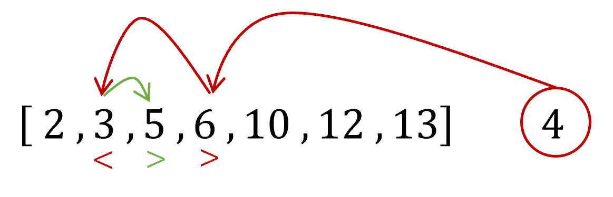

# insertion-sort

This project was built to solve the problem `Insertion Sort Advanced Analysis` on [HackerRank.com](https://www.hackerrank.com/challenges/insertion-sort/problem).

## Introduction

[Insertion sort](https://en.wikipedia.org/wiki/Insertion_sort) (IS) is one of the simpler sorting algorithms out there. One starts with the second element in the array, compare with the first, swap position if smaller. Then continuing with the third element, which will be compared to the already sorted ones, one at a time. Keep comparing and moving until the element has found its correct place in the sorted part of the array. This is repeated for all elements in the array and in the end it has been nicely sorted.

IS scales poorly, with $\mathcal{O}(N^2)$, but for small arrays it is indeed very fast and up to 16 elements it is the default array sorting algorithm in [.NET](https://learn.microsoft.com/en-us/dotnet/api/system.array.sort?view=net-6.0).

The `Insertion Sort Advanced Analysis` problem consists of **counting the number of moves** an IS makes on a given array, with the challenge to do so faster than an actual IS.

## Solution

To solve this I came up with an algorithm I have named `FiddyFiddy Sort (FFS)`. Much like IS it starts the first element of the array and moves one element at a time into it's correct position in the sorted part of the array. Unlike IS it does not compare with each element on the way to it's correct position. Instead it leverages the knowledge that the left part of the array is already sorted.

Take an element, compare it to the middle of the sorted part, if smaller compare it to the middle of the lower quarter, if instead larger then compare it to the upper quarter, and keep bisecting the array until narrowed down to exactly one spot, the element has found its home!

With the element in position, the number of moves IS would have made is given by the difference of the original and the new index.

## Conclusion

My benchmarks tell me that given an array with length $10^5$ of evenly distributed random integers, FFS is faster than IS with a factor of about 6x. Despite this it does not clear the time limits on 7 out 13 of HackerRanks tests.

### Time Complexity of FiddyFiddy Sort
A couple of words on the time complexity of FFS which I have attempted to calculate as follows.

To find the correct place for one element among *N* sorted ones, the number of required iterations *t* is given by times the array must be halved for the resulting length to become one,

$$
N\left( \frac{1}{2} \right) ^t = 1,
$$

solving for *t* gives,

$$
t = \frac{ \log N }{ \log 2}
$$

This operation must be performed for each element, the first must be inserted into the sorted array which at start only contains the zero:th element, the second element sorted into two already sorted ones, the third one into three and so on. This gives a total time that is a sum,

$$
\begin{align}
    t_{total} &= \frac{ \log 1 }{\log2} + \frac{ \log 2 }{\log2} + \frac{ \log 3 }{\log2}+... +\frac{ \log N }{ \log 2}, \\
    &= \frac{ \log \left(1 \cdot 2 \cdot 3 \cdot ... \cdot N \right) }{ \log 2}, \\
    &= \frac{ \log \left( N! \right) }{ \log 2},
\end{align}
$$

This gives a time complexity $\mathcal{O}\left(\log(N!)\right)$, this is independent of what the original array looks like, meaning this is the worst case scenario. The reader should note that this will always be lower than $\mathcal{O} \left(N \log N \right)$ which is the time complexity of `merge sort` and `quick sort`.

Does this mean that FiddyFiddySort is better than all known search algorithms, or is this because it is the first time the author has attempted to calculate big-O?

This is not for the author to say, and has instead been left as an exercise for the reader, although the empirical evidence does give a clue.
